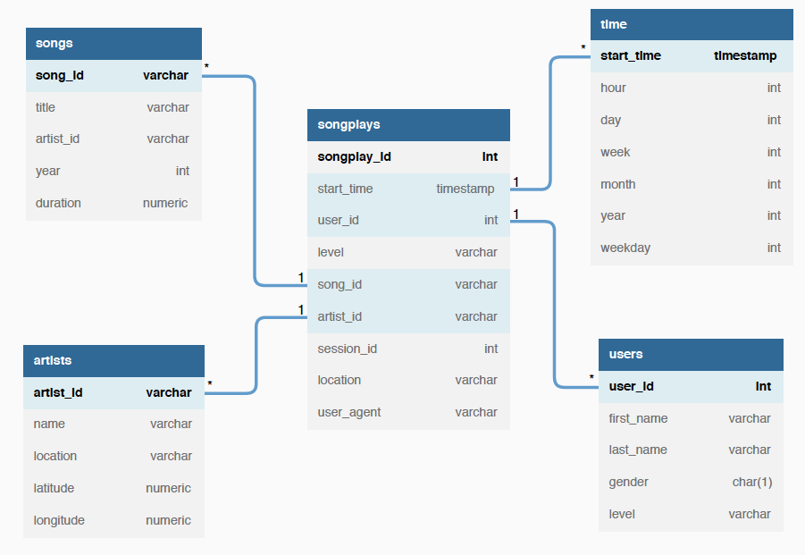

# Data Modeling with PostgreSQL

## Introduction
Data modeling is the process of designing data and making it available to machine learning engineers, data scientists, business analytics, etc., so they can make use of it easily. 

### Problem Statement
A startup company called Sparkify wants to analyze the data they've been collecting on songs and user activity on their new music streaming app. The analytics team wants to perform a song play analysis and is particularly interested in the question:

***What songs are users listening to?***. 

Currently, they don't have an easy way to query their data, which resides in a directory of JSON logs on user activity on the app, as well as a directory with JSON metadata on the songs in their app. 

### Project Objective

As a data engineer, my goal in this project is to create a Postgres database schema (and an ETL pipeline) with tables designed to optimize queries on the song play analysis. 

I will test the database and the ETL pipeline by running queries given to me by the analytic's team from Sparkify and compare my results with their expected results.

### TODOs

- Define facts and dimension tables for a star scheme

- Build an ETL pipeline that transfers data from files in two local directories into the tables in Postgres using python and SQL.

## Description of submitted files

There are 8 files in total associated with this project.

- **data**: There are two datasets. The first dataset is a subset of real data from the [Million Song Dataset](http://millionsongdataset.com) in JSON format. The second dataset consists of log files in JSON format. 

- **create_tables.py**: python script that drops and creates our tables

- **etl.ipynb**: Jupyter notebook that reads and processes a single file from song_data and log_data and loads the data into our tables.

- **etl.py**: Python script holding our ETL pipeline: reads and processes files from song_data and log_data and loads them into our tables. 

- **ERD_Diagram.png** is our entity relation diagram for our star schema. 

- **sql_queries.py**: python file that contains all  our sql queries

- **test.ipynb**: A Jupyter notebook that displays the first few rows of each table to let us check ur database.

## Databse Schema

After examining the Log data and Song data respectvely, I created a Star schema (shown below) that include one Fact table (songplays) and 4 Dimension tables (songs, artists, time and users). 
.

## Sample Queries

## Deployment

In other to deploy this project on your machine, you will need access and knowledge of

- Python 3
- SQL
- pandas and psycopg2
- A PosgreSQL database is available on localhost

## Running the Python Scripts

If you would like to run the script:

On your terminal:

- python create_tables.py, then
- python etl.py

In IPython:

- run create_tables.py
- run etl.py

